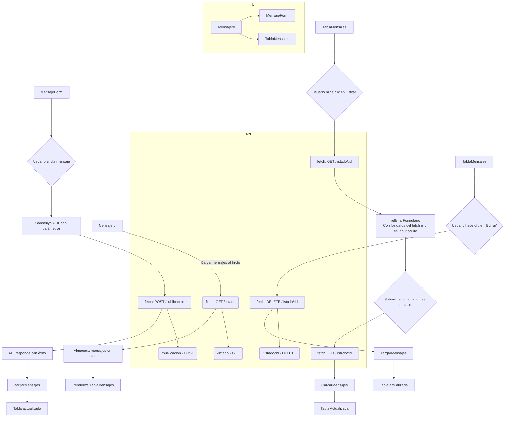

# Esquema de funcionamiento del componente Mensajero

```mermaid
flowchart TD
 subgraph UI["UI"]
        R["MensajeForm"]
        Q["Mensajero"]
        S["TablaMensajes"]
  end
 subgraph API["API"]
        T("/listado - GET")
        B("fetch: GET /listado")
        U("/publicacion - POST")
        H["fetch: POST /publicacion"]
        V("/listado/:id - DELETE")
        N["fetch: DELETE /listado/:id"]
        W["fetch: GET /listado/:id"]
        X["fetch: PUT /listado/:id"]
  end
    A["Mensajero"] -- Carga mensajes al inicio --> B
    B --> C["Almacena mensajes en estado"] & T
    C --> D["Renderiza TablaMensajes"]
    E["MensajeForm"] --> F{"Usuario envía mensaje"}
    F --> G["Construye URL con parámetros"]
    G --> H
    H --> I["API responde con éxito"] & U
    I --> J["cargarMensajes"]
    J --> K["Tabla actualizada"]
    L["TablaMensajes"] --> M@{ label: "Usuario hace clic en 'Borrar'" }
    M --> N
    N --> O["cargarMensajes"] & V
    O --> P["Tabla actualizada"]
    Q --> R & S
    n2["TablaMensajes"] --> n3@{ label: "Usuario hace clic en 'Editar'" }
    n3 --> W
    W --> n5["rellenarFormulario<br>Con los datos del fetch e id en input oculto"]
    n6["Submit del formulario tras editarlo"] --> X
    n5 --> n6
    X --> n8["CargarMensajes"]
    n8 --> n9["Tabla Actualizada"]
    M@{ shape: diamond}
    n2@{ shape: rect}
    n3@{ shape: diam}
    n5@{ shape: rect}
    n6@{ shape: diam}
    n9@{ shape: rect}
```
